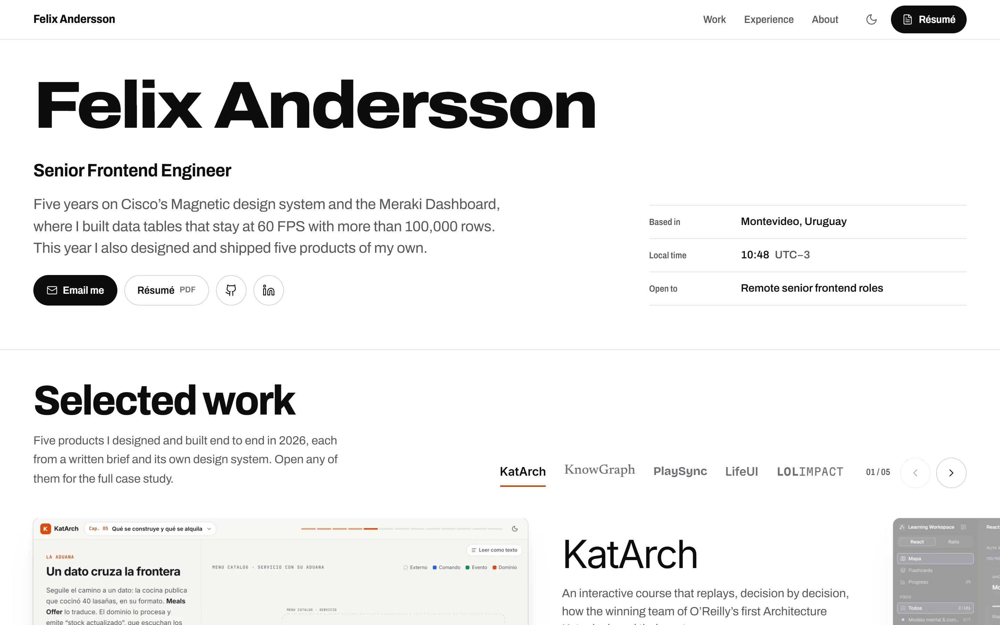
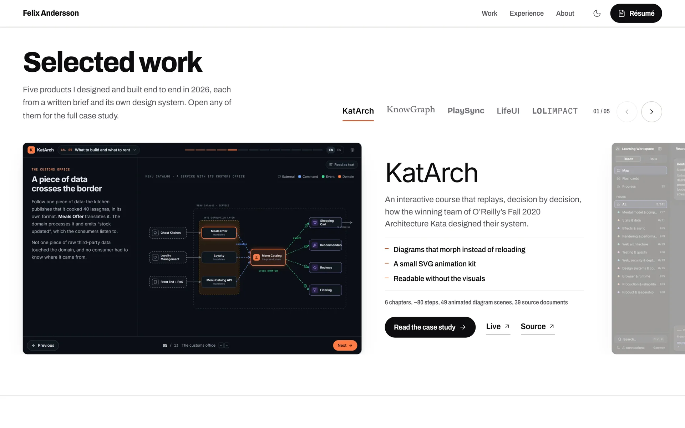
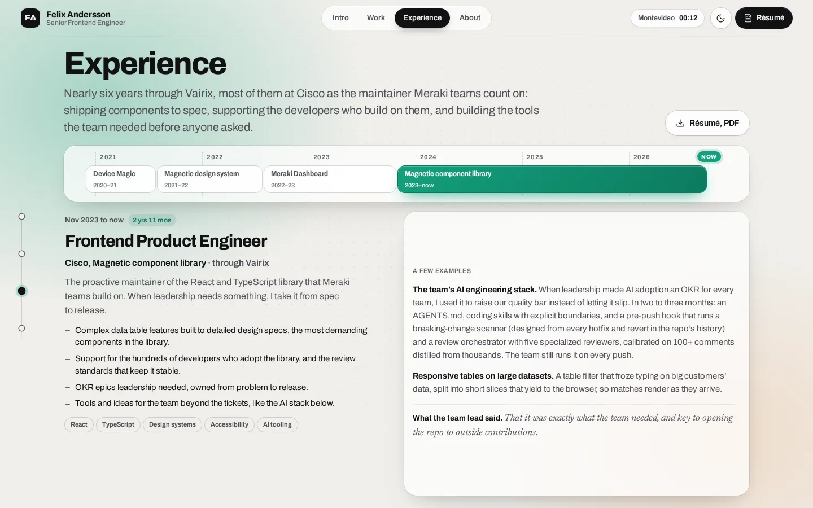
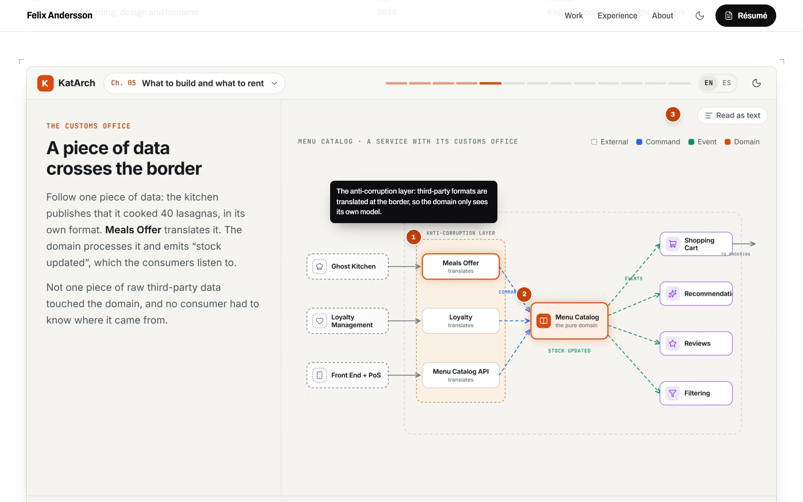
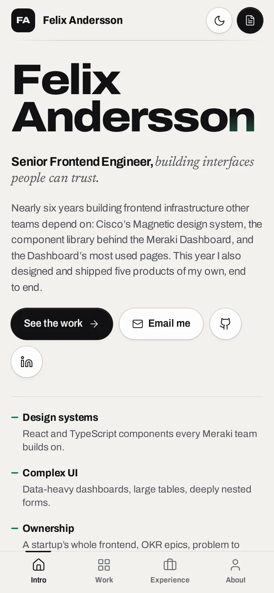

# Felix Andersson, portfolio

Personal site of Felix Andersson, Senior Frontend Engineer in Montevideo. Five years on Cisco's Magnetic design system and the Meraki Dashboard, plus products of my own, designed and built end to end. Built like a desktop app: one fixed window, full-height sections that move one at a time.

**[portfolio-felix-teal.vercel.app](https://portfolio-felix-teal.vercel.app/)** · [Résumé (PDF)](public/felix-andersson-resume.pdf) · [LinkedIn](https://www.linkedin.com/in/felixandersson/) · [GitHub](https://github.com/Felichz)

<picture>
  <source media="(prefers-color-scheme: dark)" srcset="docs/screenshots/home-dark.webp">
  
</picture>

## What's on it

The site works like a desktop app in a fixed window: a bar on top, a rail of section dots down the left edge, and full-height sections that move one at a time. A scroll gesture jumps to the next section; a section scrolls inside itself only when the window is too small for it. On phones the sections scroll naturally and the rail becomes a tab bar.

- **Intro.** Name, role, the short version, what I bring, and a portrait.
- **Work.** A showcase of six products, this site included. Each product's screen recording plays, holds on its last frame, and the next one slides in; the rail fills in the product's color as its turn runs. Pause it with the button, or by reading the product copy.
- **Experience.** The CV: roles from 2020 to now on a continuous timeline, with the detail of the selected role below and a few concrete examples in prose.
- **About.** How I got here, the toolset, and contact.
- **One case study per product** (`/work/katarch`, `/work/knowgraph`, ...), as five sections: Overview with the lead screenshot, its recording and numbered callouts; Story; Engineering; Screens; Specs and the next case study.
- **Two editions.** Warm stone and near-black, chosen before first paint from the saved choice or the system setting, toggled from the bar. Screenshots print in the opposite edition, so each product stands out from the page.

<table>
  <tr>
    <td width="50%">
      <picture>
        <source media="(prefers-color-scheme: dark)" srcset="docs/screenshots/work-dark.webp">
        
      </picture>
      <br><sub>The showcase: auto-advancing, one product at a time.</sub>
    </td>
    <td width="50%">
      <picture>
        <source media="(prefers-color-scheme: dark)" srcset="docs/screenshots/experience-dark.webp">
        
      </picture>
      <br><sub>Experience as a timeline, with the selected role below.</sub>
    </td>
  </tr>
  <tr>
    <td width="50%">
      <picture>
        <source media="(prefers-color-scheme: dark)" srcset="docs/screenshots/case-dark.webp">
        
      </picture>
      <br><sub>A case study's first section.</sub>
    </td>
    <td width="50%" align="center">
      <picture>
        <source media="(prefers-color-scheme: dark)" srcset="docs/screenshots/mobile-dark.webp">
        
      </picture>
      <br><sub>On a phone: sections scroll naturally, with a tab bar.</sub>
    </td>
  </tr>
</table>

## Details that took some care

- **Tapes instead of videos.** Every product's preview, and this site's own, is a tape: the app's DOM recorded while a scripted scene drives it in headless Chrome, then replayed in a script-less iframe with the app's real stylesheet. The five products' tapes weigh 230 KB gzipped, in place of 17.7 MB of video (two files per product, one per theme); they play in either theme and stay sharp at any size.
- **Live previews.** After the visitor's first input (never during page load, so Lighthouse stays at 100), the app's own build, vendored under `/apps/<id>/`, boots under the preview and keeps up with the tape by replaying its recorded clicks, with its clock and timers following the recording. Hover a preview and it becomes the live app on the same frame: you can use it right there. Its window lights keep to your side of it; the green one moves the app (with `moveBefore`, state intact) into a window at its own size, with the case study, the website and the source under it. On this site's own slide, the preview is the site, live, inside itself.
- **Previews in a process of their own.** Each preview (its tape and its live app) runs in a stage, a small document the page embeds and drives with messages. Served from another site than the page, the browser gives it its own process, so building a tape or booting an app never costs the page a frame. The page does no work per frame while a preview plays: the showcase countdown and the tape's cursor run on the compositor, and tapes apply recorded changes only when they fall due. Apps boot one at a time once a preview has been on screen for a moment; one the visitor used is held, clock stopped, when it leaves the screen. Measured with `scripts/perf/` (traces of the old and new builds, alternating): the page's main thread while a preview plays went from 63–74% busy to under 15%.

- One navigation model for wheel, trackpad, touch, keys, tabs and links. A wheel gesture moves one section, unless it started by scrolling something inside the section.
- Deep links (`/#experience`, `/#work/lifeui`) open on their section and product before the first paint.
- The name is set one glyph at a time along Archivo's width axis: letters widen into place on arrival and swell toward the pointer.
- A cursor light: a soft pool of color follows the pointer and brings up the dot grid under it, with a lens bulge. Buttons are magnetic, the portrait and the showcase window tilt toward the pointer, and a scrubber on the Experience timeline names the month and role under the cursor.
- The room light follows the content: each section, and each product in the showcase, sets the colors of the ambient glow.
- The showcase screenshot and product name morph into the case study header (cross-document view transitions).
- Kept cheap to render: no backdrop blur, static ambient layers. The theme toggle fades the other edition in over the whole page, a view transition that only blends two pictures, with transitions suspended.
- Everything sizes against the window with container units, and tightens on short screens.
- Reduced motion: no autoplay, no tilt, instant section moves.
- Static output, responsive AVIF/WebP images, recordings that load only when they play, self-hosted font subsets, no client framework.

## Stack

Astro 7, TypeScript, hand-written CSS with custom properties. Deployed as a static site.

## Tapes and live apps

The full story is in the write-up, [The previews are the apps](https://portfolio-felix-teal.vercel.app/work/portfolio/how-its-built/).

```bash
node scripts/apps/vendor.mjs <id>        # build a product for /apps/<id>/ (its repo checked out next to this one)
node scripts/tapes/record.mjs <id>       # record public/tapes/<id>.json from its scene
node scripts/tapes/record.mjs portfolio  # this site's Intro, from dist/ (build first)
```

| Product | Built from | Recording needs |
| --- | --- | --- |
| KatArch | `../katarch/v2` | nothing |
| KnowGraph | `../learning-embed` (branch `portfolio-embed`: base-aware routes, no service worker in a frame) | nothing; its study history is restored from the repo's fixture and kept as IndexedDB |
| PlaySync | `../rave2-embed` (branch `portfolio-embed`: no service worker, video muted in a frame) | the real server, clock pinned: `PIN=15:24 PORT=3099 npx tsx --import ../portfolio/scripts/tapes/pin-clock.mjs server/index.ts` |
| LifeUI | `../life-ui-embed` (branch `portfolio-embed`: router basename) | nothing |
| LoLImpact | `../LoLImpact/frontend` | its backend: `python -m uvicorn app.main:app --port 8010` in `backend/` |

Scenes live in `scripts/tapes/scenes/`. The stage is `src/pages/stage.astro` (`src/scripts/stage.ts`: the tape player `src/scripts/tape.ts` and the live app's session `src/scripts/session.ts`), the page's `<tape-player>` `src/scripts/player.ts`, the live previews and their window `src/scripts/live.ts`, the bridge inlined into vendored apps `scripts/apps/bridge.js` (clock and timers, recorded API answers, the route), and PlaySync's stand-in room `scripts/apps/playsync-room.js`. After a bridge change, `node scripts/apps/vendor.mjs --bridge` puts it into the built apps without rebuilding them.

Stages load from `PUBLIC_STAGE_ORIGIN` when it's set at build time: another registrable domain serving this same deployment (a subdomain is the same site, and gets no process of its own), such as a second `*.vercel.app` domain added to the project. Locally a page on `localhost` loads them from `127.0.0.1` (the dev and preview servers listen there). Without either, stages load from the page's own origin and run in its process.

```bash
node scripts/perf/check.mjs              # every preview plays, goes live, and the stage is out of process
node scripts/perf/check.mjs --gate       # + frame budgets: steady phases p99 <= 16.7 ms, no gap > 100 ms; cold transients p99 <= 100 ms, no gap > 500 ms
npm run perf:gate                        # the gate at 2x CPU throttling
node scripts/perf/live.mjs [label]       # fps of every interaction: the cycle, hover to live, the window
node scripts/perf/scroll.mjs             # fps of scrolling the portfolio: slow down, fast back up
node scripts/perf/trace.mjs <label>      # traces of the showcase's moments, summarized per process
node scripts/perf/ab.mjs base,noshadow   # one thing switched off at a time, alternating runs
```

**The frame budget.** Every interaction is measured (`--gate`), the page keeps a flight recorder
(`src/scripts/blackbox.ts`: frame gaps over 250 ms dump what was mounting, whether the window was
open, whether the page was flinging), and the heavy work obeys the page's quiet: stages mount one at
a time, never under the visitor; a product change is three modest frames (the rail answers first,
the slide lands next, the recording and the address last), with the incoming slide's textures
pre-rastered off its countdown; the panel's room light is resolved at build time (a `data-p` flip,
not four variables through the subtree); a boot starts where the tape ended (every tape records a
final checkpoint) with its bytes already warm (`warm-bytes`, fired when the slide turns active —
never during the boot itself: a fetch in flight would deduplicate against the frame's own load);
under the pointer the tape answers as a ghost until the real app takes it; the bridge owns the app's
frames as it owns its clock — an app nobody sees fires none, and one that is seen runs at the
highest steady cadence the stage measures the machine to hold (`setPace`), with its endless
animations resting at reduced pace; while one preview has the machine, every other tape lets its
document go. Measured results along the way: a 800 ms three-stage mount burst -> 84 ms; the window
morphs 60-71% hitched -> 0-22%; a heavy app in its window 58 fps/71% hitched -> 240/0 (playsync,
whose YouTube player is beyond the bridge: 42 -> 95).

## Running it

```bash
npm install
npm run dev      # http://localhost:4321
npm run build    # astro check + static build into dist/
npm run preview  # serve dist/
```

## Where things live

| Path | What |
| --- | --- |
| `src/data/projects.ts` | Every product: order, copy, stack, scale, accent colors, screenshots, callouts, gallery. |
| `src/pages/index.astro` | Home sections: `Intro`, `Work` (the showcase), `Experience` (the timeline), `About`. |
| `src/data/career.ts` | Time in frontend, computed at build time. |
| `src/pages/work/[id].astro` | Case study template (five sections), generated from `projects.ts`. |
| `src/layouts/Base.astro` | The app shell: head, pre-paint theme and deep-link scripts, `Bar`, the section rail (`Dock`), the deck, image viewer. |
| `src/scripts/deck.ts` | The vertical deck: wheel, keys, links, hash, section rail and ambient light. |
| `src/scripts/fx.ts` | Pointer spotlight and tilt. |
| `src/components/Plate.astro` | Theme-aware screenshot in a browser window, with the recording player. |
| `src/styles/global.css` | Tokens for both editions, ambient layers, shell, surfaces, buttons, plates, pins. |
| `src/assets/portrait/` | The portrait, a dark and a white studio shot (the site shows the opposite one). |
| `src/assets/shots/` | Product screenshots (WebP, 2x), as `name-light` / `name-dark`. |
| `src/assets/motion/` | Screen recordings (H.264 MP4, 1920 wide), as `name-light` / `name-dark`. |
| `docs/screenshots/` | The images in this README. |

To update a product screenshot, capture 16:10 at 2x in both themes, keep the file names, and adjust the callout coordinates (`x`, `y` in percent) in `projects.ts` if the layout changed. A lead shot with a recording should use the recording's last frame as its still, so the hand-off from video to callouts is seamless.

## Deploy

Any static host works. On Vercel: import the repo, framework preset Astro, no extra settings.

Design context: [`PRODUCT.md`](PRODUCT.md) (audience, voice, evidence) and [`DESIGN.md`](DESIGN.md) (the visual system).

## The products

| | |
| --- | --- |
| [KatArch](https://github.com/Felichz/katarch) | An interactive course that replays how the winning team of O'Reilly's Fall 2020 Architecture Kata made each decision. |
| [KnowGraph](https://github.com/Felichz/KnowGraph) | Senior React and Rails interview prep as a map of 142 concepts, with an AI mentor that grades your explanations. |
| [PlaySync](https://github.com/Felichz/PlaySync) | Synced YouTube watch parties with no accounts and a server-owned clock. |
| [LifeUI](https://github.com/Felichz/life-ui) | A HUD for real life: time blocks, one running activity, and an honest closing ritual. |
| [LoL-Impact](https://github.com/Felichz/LoL-Impact) | League of Legends win probability, minute by minute, with the uncertainty shown. |
